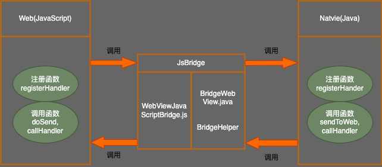

# JsBridge

-----

Inspired and modified from [this](https://github.com/jacin1/JsBridge) and WeChat jsBridge file, with some bug fixes and feature enhancements.

This project makes a bridge between Java and JavaScript.

It provides a safe and convenient way to call Java code from JavaScript and call JavaScript code from Java.

## How JsBridge Works


## Demo


## Usage

## JitPack.io

I strongly recommend [JitPack.io](https://jitpack.io)

```groovy
repositories {
    // ...
    maven { url "https://jitpack.io" }
}

dependencies {
    compile 'com.github.lzyzsd:jsbridge:1.0.4'
}
```

## Use it in Java

Add `com.github.lzyzsd.jsbridge.BridgeWebView` to your layout, it is inherited from WebView.

### Register a Java handler function so that JavaScript can call

```java

    webView.registerHandler("submitFromWeb", new BridgeHandler() {
        @Override
        public void handler(String data, CallBackFunction function) {
            Log.i(TAG, "handler = submitFromWeb, data from web = " + data);
            function.onCallBack("submitFromWeb exe, response data from Java");
        }
    });

```

JavaScript can call this Java handler method "submitFromWeb" through:

```javascript

    WebViewJavascriptBridge.callHandler(
        'submitFromWeb'
        , {'param': str1}
        , function(responseData) {
            document.getElementById("show").innerHTML = "send get responseData from java, data = " + responseData
        }
    );

```

You can set a default handler in Java, so that JavaScript can send messages to Java without an assigned handlerName

```java

    webView.setDefaultHandler(new DefaultHandler());

```

```javascript

    window.WebViewJavascriptBridge.doSend(
        data
        , function(responseData) {
            document.getElementById("show").innerHTML = "responseData from java, data = " + responseData
        }
    );

```

### Register a JavaScript handler function so that Java can call

```javascript

    WebViewJavascriptBridge.registerHandler("functionInJs", function(data, responseCallback) {
        document.getElementById("show").innerHTML = ("data from Java: = " + data);
        var responseData = "Javascript Says Right back aka!";
        responseCallback(responseData);
    });

```

Java can call this JavaScript handler function "functionInJs" through:

```java

    webView.callHandler("functionInJs", new Gson().toJson(user), new CallBackFunction() {
        @Override
        public void onCallBack(String data) {

        }
    });

```
You can also define a default handler using the init method, so that Java can send messages to JavaScript without an assigned handlerName

For example:

```javascript

    window.WebViewJavascriptBridge.init(function(message, responseCallback) {
        console.log('JS got a message', message);
        var data = {
            'Javascript Responds': 'Wee!'
        };
        console.log('JS responding with', data);
        responseCallback(data);
    });

```

```java
    webView.send("hello");
```

will print 'JS got a message hello' and 'JS responding with' in webview console.

### Persistent Callbacks (New Feature)

By default, callbacks are deleted after first use. However, you can now use persistent callbacks that can be reused multiple times:

#### Java Side

```java
// Use persistent callback that won't be deleted after first use
webView.callHandlerPersistent("functionInJs", data, new OnBridgeCallback() {
    @Override
    public void onCallBack(String data) {
        // This callback can be called multiple times
        Log.d(TAG, "Persistent callback called: " + data);
    }
});
```

#### JavaScript Side

```javascript
// Use persistent callback
WebViewJavascriptBridge.callHandlerPersistent("javaHandler", data, function(response) {
    // This callback can be reused multiple times
    console.log("Persistent callback response: " + response);
});

// Register and manually manage persistent callbacks
var callbackId = "my_persistent_callback";
WebViewJavascriptBridge.registerPersistentCallback(callbackId, function(data) {
    console.log("Persistent callback called: " + data);
});

// Remove persistent callback when no longer needed
WebViewJavascriptBridge.removePersistentCallback(callbackId);
```

This feature is useful when you need to maintain a long-term communication channel between Java and JavaScript, such as for real-time updates or event notifications.

### Switch to CustomWebView
* activity_main.xml
```xml
    <com.github.lzyzsd.jsbridge.example.CustomWebView
        android:id="@+id/webView"
        android:layout_width="match_parent"
        android:layout_height="match_parent" >
     </com.github.lzyzsd.jsbridge.example.CustomWebView>
```
* MainActivity.java
Change BridgeWebView class to CustomWebView:
```java
    CustomWebView webView = (CustomWebView) findViewById(R.id.webView);
    
```

## Notice

This library will inject a WebViewJavascriptBridge Object to the window object.
You can listen to the `WebViewJavascriptBridgeReady` event to ensure `window.WebViewJavascriptBridge` exists, as the below code shows:

```javascript

    if (window.WebViewJavascriptBridge) {
        //do your work here
    } else {
        document.addEventListener(
            'WebViewJavascriptBridgeReady'
            , function() {
                //do your work here
            },
            false
        );
    }

```

Or put all JsBridge function call into `window.WVJBCallbacks` array if `window.WebViewJavascriptBridge` is undefined, this task queue will be flushed when `WebViewJavascriptBridgeReady` event triggered.

Copy and paste setupWebViewJavascriptBridge into your JS:

```javascript
function setupWebViewJavascriptBridge(callback) {
	if (window.WebViewJavascriptBridge) {
        return callback(WebViewJavascriptBridge);
    }
	if (window.WVJBCallbacks) {
        return window.WVJBCallbacks.push(callback);
    }
	window.WVJBCallbacks = [callback];
}
```

Call `setupWebViewJavascriptBridge` and then use the bridge to register handlers or call Java handlers:

```javascript
setupWebViewJavascriptBridge(function(bridge) {
	bridge.registerHandler('JS Echo', function(data, responseCallback) {
		console.log("JS Echo called with:", data);
		responseCallback(data);
    });
	bridge.callHandler('ObjC Echo', {'key':'value'}, function(responseData) {
		console.log("JS received response:", responseData);
	});
});
```

It's the same as [WebViewJavascriptBridge](https://github.com/marcuswestin/WebViewJavascriptBridge), which makes it easier for you to define the same behavior across different platforms between Android and iOS, while writing concise code.

## License

This project is licensed under the terms of the MIT license.
